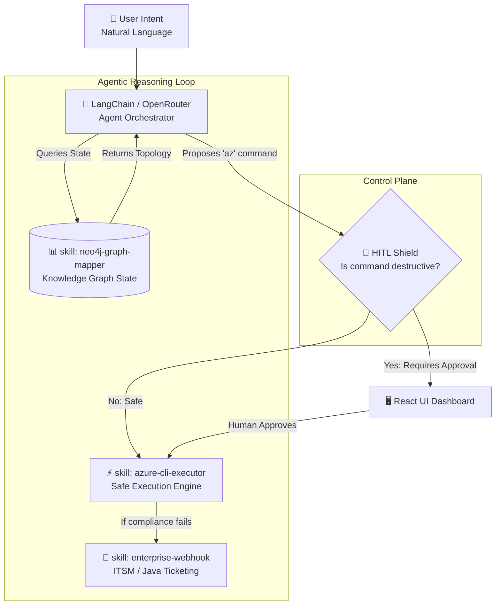
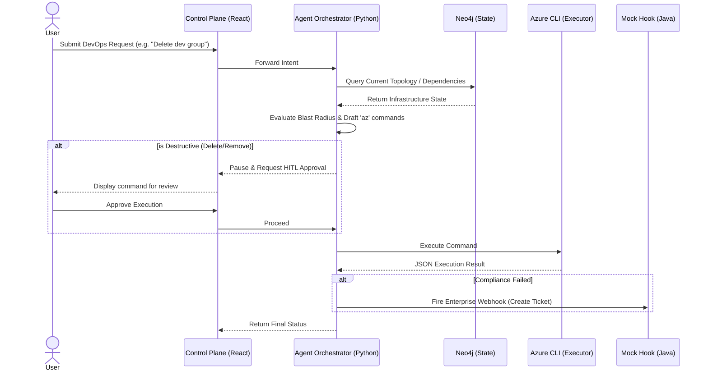

# Agentic Infrastructure Blueprint

A learning-level AI agent scaffolding for Cloud DevOps. Features a React Human-in-the-Loop (HITL) dashboard, Neo4j infrastructure state mapping, and safe Azure CLI execution using Model Context Protocol (MCP).

## 🧠 Architectural Mindmap

## 🔄 Interaction Sequence Flow

Here is exactly how the data moves through the blueprint from a user requesting a change to the final execution:

## 🏗️ How It Works (For Copilot / Claude Users)

This repository is built natively for AI Code Assistants (like VS Code Copilot or Claude Code). It utilizes declarative `.md` files to route agent behavior recursively.

1. **`AGENTS.md`**: Registers the `cloud-devops-agent`.
2. **`.instructions.md`**: Restricts the agent to strict blast-radius controls.
3. **`skills/` Directory**: Teaches the agent *how* to use the knowledge graph or execute tools natively via RAG (Retrieval-Augmented Generation).

## 🚀 Getting Started

1. Copy `.env.example` to `.env` and fill in your OpenRouter API Key and Azure credentials.
2. Ensure Docker Desktop / Engine is running.
3. Run `docker-compose up --build -d` to spin up the platform.
4. Access the **Control Plane UI** at `http://localhost:3000`.
5. Access the **Graph Database Maps** at `http://localhost:7474`.

## Security & Guardrails

- **No Hardcoded Secrets:** Strict `.env` segregation.
- **Blast Radius Control:** Any intent carrying `delete`, `drop`, or `remove` operations triggers a forced `HITL_APPROVAL_REQUIRED` state.
- **Sanitization:** All CLI inputs are evaluated via a secondary LLM validator step before execution.
